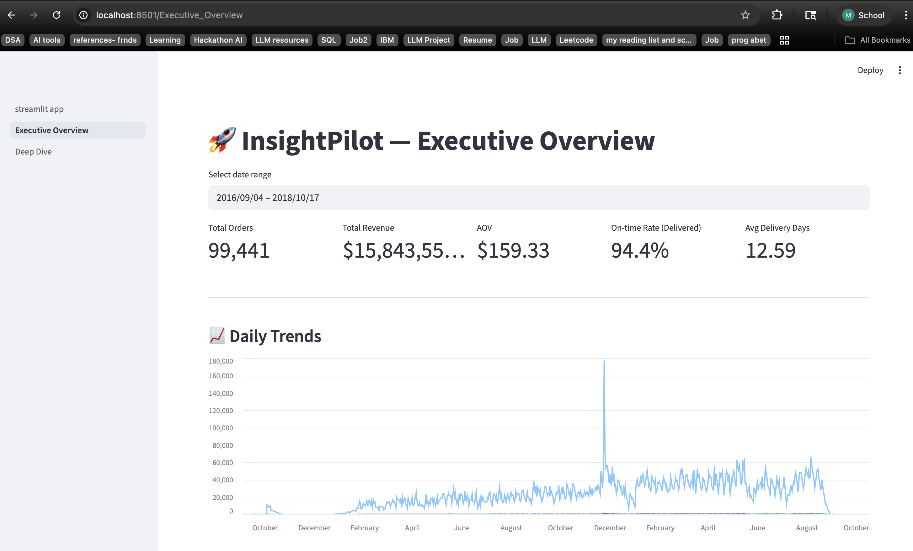
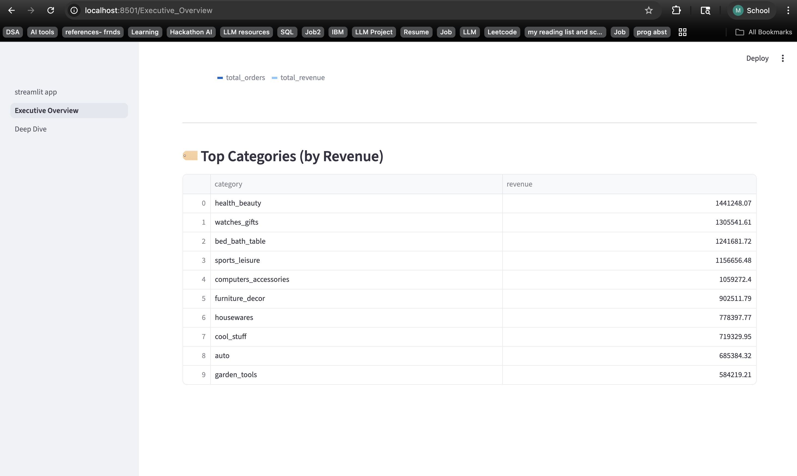
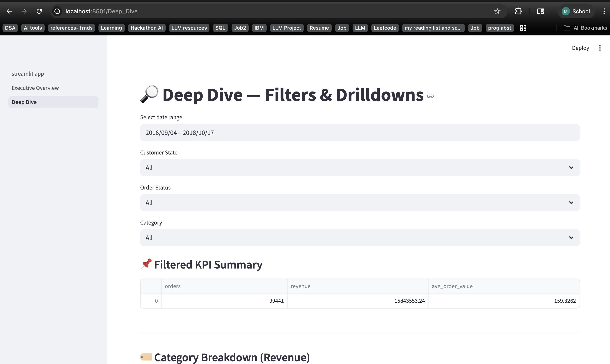
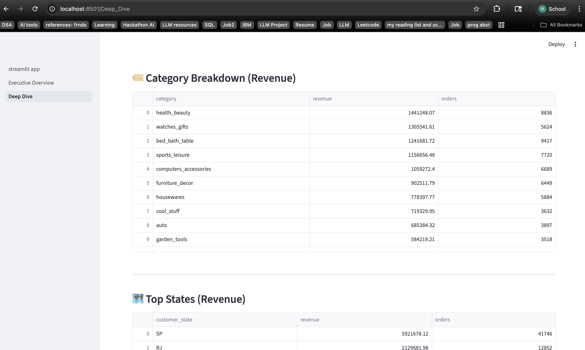
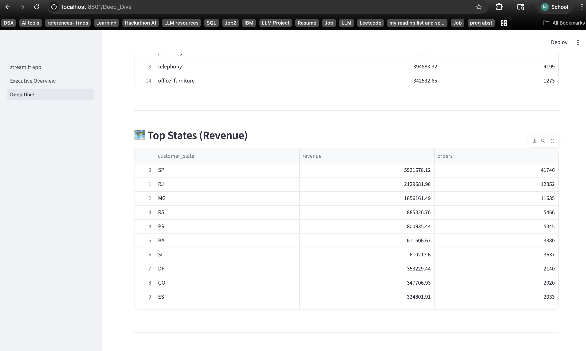
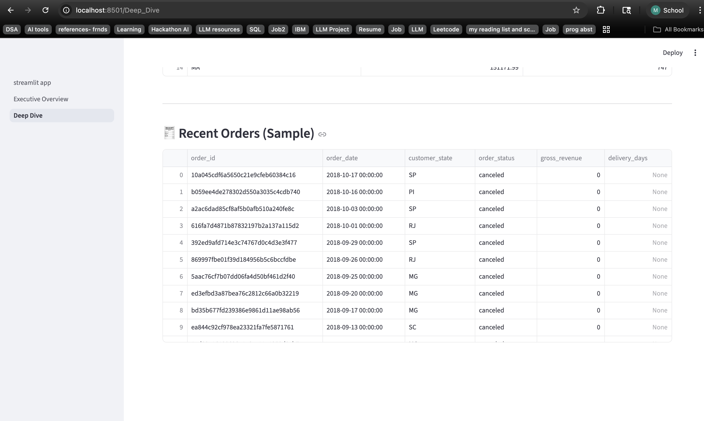
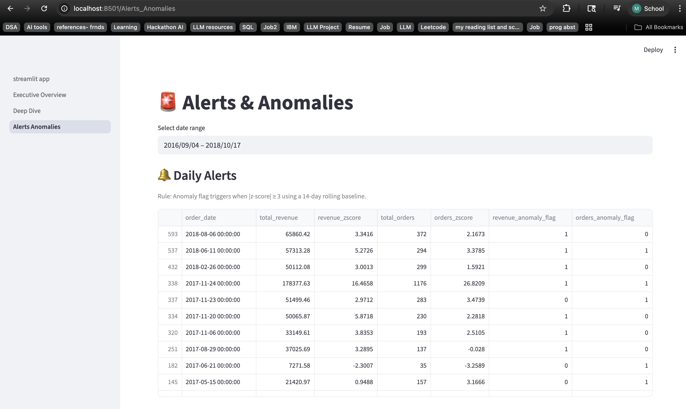
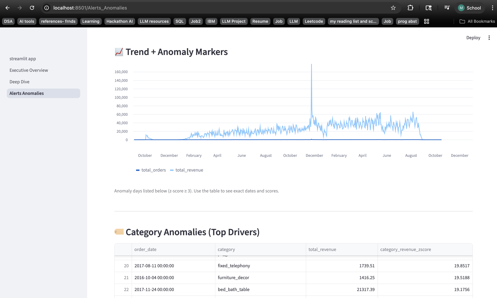
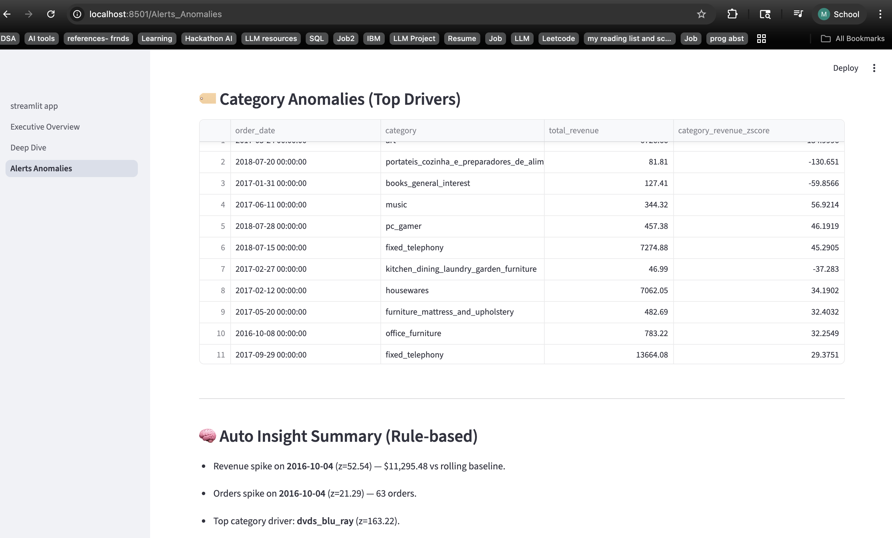

# 🚀 InsightPilot
### Agentic SQL Analytics Platform

InsightPilot is an **agent-based analytics** system that converts business questions into validated SQL queries, executes them on structured analytics tables, and produces executive-ready insights with optional AI rewriting.


This project is built incrementally to reflect **real-world data engineering and analytics workflows**
used in big tech companies.

---

## 🎯 Problem Statement
Business and analytics teams often spend significant time manually:
- Querying raw data
- Validating KPIs
- Building dashboards
- Writing performance summaries

This process is slow, error-prone, and difficult to scale, especially when teams rely on manual SQL queries and fragmented analytics workflows.

**InsightPilot** automates this workflow by combining:
- A structured SQL data warehouse (Bronze → Silver → Gold layers)
- Analytics dashboards for KPI monitoring
- Agent-based analytics workflows
- Deterministic insight generation with optional AI narrative rewriting
  
The result is a system that allows users to ask business questions in natural language and receive validated, data-driven insights instantly.

---
## Project Overview

InsightPilot demonstrates how AI agents can interact with data warehouses safely while preserving deterministic analytics logic.

The system answers business questions such as:
- What are the overall KPIs?
- What categories generate the most revenue?
- Why did revenue spike on a certain date?
- Which states or segments drove performance?

Unlike traditional text-to-SQL systems, InsightPilot uses:
- guardrailed SQL execution
- predefined analytics intents
- structured insight generation
- optional LLM narrative rewrite

This ensures accuracy, explainability, and production safety.

---

<!-- ## ✅ Current Progress (Day 1–13)

- ✔️ Defined business requirements, KPIs, and analytics use cases  
- ✔️ Designed a Medallion Architecture (Bronze / Silver / Gold)  
- ✔️ Initialized project repository and environment  
- ✔️ Ingested raw e-commerce data into DuckDB (Bronze layer)  
- ✔️ Preserved source schemas and validated record counts  

---
-->

## 🏗️ Architecture (High Level)

```text
User Question
     ↓
Rule-based Intent Detection
     ↓
SQL Analytics Agent
     ↓
Gold Layer Analytics Tables
     ↓
Structured Metrics
     ↓
Deterministic Insight Engine
     ↓
Optional LLM Narrative Rewrite

```
Key design principle:

LLM never generates SQL or analytics logic.

All queries are deterministic and validated.

> AI agents operate **only on Gold-layer data** to ensure correctness and prevent hallucinations.

---

## Core Features

### SQL Analytics Agent
Converts supported business questions into validated SQL queries.

### Deterministic Insight Engine
Produces structured insights including:
- What happened
- Why it happened
- Business impact
- Recommended next steps

### Guardrails
Ensures safe execution:
- Read-only SQL
- Approved table access
- Prevents destructive queries

### Executive Narrative Layer (Optional)
Uses OpenAI to rewrite structured insights into executive-friendly explanations.

LLM is used only for communication improvement, not analytics.

---
## Supported Questions

Examples of supported analytics queries:

```text
KPI summary
Show overall KPIs
Top categories by revenue
Why did revenue spike on 2017-11-24?
Show top states on 2017-11-24
```


## 🛠️ Tech Stack

**Data & Storage**
- CSV (source data)
- DuckDB (analytical warehouse)

**Data Architecture**
- Bronze → Silver → Gold warehouse layers
- SQL-based transformations

**Analytics**
- SQL (KPI computation, anomaly detection)
- Python (pandas, numpy)

**Backend / Agents**
- Python
- SQL Analytics Agent
- Rule-based intent detection
- Guardrails for safe SQL execution

**AI Layer(In Progress)**
- OpenAI API
- LLM narrative rewrite layer
- Deterministic insight generation

**Dashboards**
- Streamlit (multi-page analytics interface)
- Plotly (visualizations)

**Evaluation & Testing**
- Structured test questions
- Agent validation framework

**Dev & Docs**
- GitHub (version control)
- Notion (project tracking)
- draw.io (architecture diagrams)

---

## 📂 Project Structure

```text
InsightPilot-SQL-AgenticAI
│
├── agents
│   ├── __init__.py
│   ├── db.py
│   ├── guardrails.py
│   ├── logger.py
│   ├── narrative_llm.py
│   ├── sql_agent.py
│   └── sql_agent.pyx
│
├── app
│   ├── streamlit_app.py
│   └── pages
│       ├── 1_Executive_Overview.py
│       ├── 2_Deep_Dive.py
│       ├── 3_Alerts_Anomalies.py
│       └── 4_Ask_the_Data.py
│
├── dashboards
│   └── assets
│
├── data
│   └── raw                ← Bronze Layer
│
├── sql
│   ├── silver             ← Silver Layer
│   └── gold               ← Gold Layer
│
├── warehouse
│   ├── init_db.py
│   ├── run_sql.py
│   └── insightpilot.duckdb
│
├── evaluation
│   ├── dq_checks.sql
│   └── run_dq_checks.py
│
├── tests
│   └── test_agent.py
│
├── screenshots
│
├── agent_logs.json
├── METRICS.md
├── requirements.txt
├── README.md
└── check.py

```


---

## 📊 Dataset
This project uses the **Olist Brazilian E-commerce Dataset**, which includes:
- Orders
- Customers
- Products
- Sellers
- Payments
- Reviews
- Geolocation data

The dataset is well-suited for:
- Revenue analytics
- Funnel analysis
- Operational KPIs
- Anomaly detection
## 📸 Dashboard Preview(TBD)

<!--  **Executive Overview** 


**Deep Dive**




## 🚨 Alerts & Anomalies

Detects daily revenue/order spikes using a 14-day rolling baseline + z-score, and surfaces category-level drivers.



 -->

---

## Setup Instructions

1. Clone repository
```bash
git clone https://github.com/Mounika-Geriki/InsightPilot-SQL-AgenticAI.git
cd InsightPilot-SQL-AgenticAI
```
2. Create virtual environment
```bash
python -m venv venv
source venv/bin/activate
```
3. Install dependencies
```bash
pip install -r requirements.txt
```
4. Configure environment

Copy .env.example
```bash
cp .env.example .env
```
Edit .env
```bash
LLM_MODE=off
LLM_PROVIDER=openai
OPENAI_MODEL=gpt-4.1-mini
OPENAI_API_KEY=your_key_here
```

## Run the Application
```bash
streamlit run app/streamlit_app.py
```
Open in browser:
```bash
http://localhost:8501
```
Navigate to Ask the Data to query analytics.

## Future Improvements

Planned enhancements include:
- LLM-based intent detection
- dynamic question routing
- anomaly root cause analysis
- automated agent evaluation framework
- dashboard alerting system

---

## 📌 Note
This project focuses on **data modeling, data quality, and analytics correctness first**.
The architecture is designed to be **portable to Spark, Airflow, and cloud warehouses**
in a production environment.

---

## 📄 License

This project is licensed under the MIT License.

You are free to use, modify, and distribute this software with proper attribution.

See the full license here: [MIT License](LICENSE)
